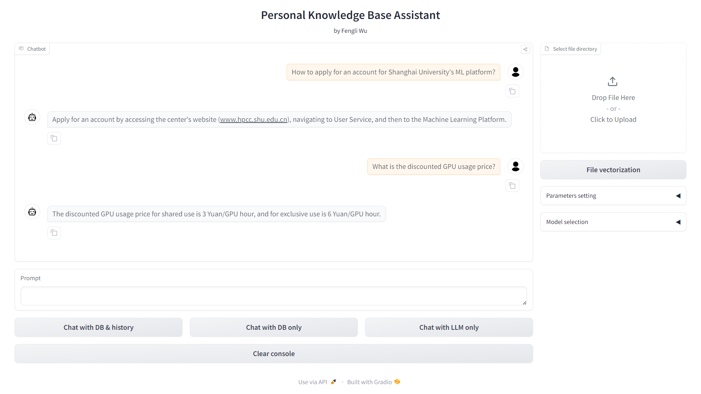

# Personal Knowledge Base Assistant



## Description
This project is a knowledge base assistant with retrieval-augmented generation (RAG) based on LangChain and Gradio. It integrates various large language models (LLMs) and embeddings to provide a comprehensive question-answering system with and without history.


## Key Features
- **QA Chains**: Supports both QA chains with and without history.
- **Multiple LLMs**: Integrates multiple large language models including OpenAI, Wenxin, Xinhuo, and ZhipuAI.
- **Embeddings**: Supports embeddings from OpenAI, ZhipuAI, and M3E.
- **Gradio Interface**: Provides an interactive Gradio interface for user interaction.
- **Environment Configuration**: Uses dotenv for managing environment variables.

## Tech Stack
- **LLM Framework**: LangChain
- **Web Interface**: Gradio
- **Vector Database**: Chroma DB

## Project Structure
```plaintext
Personal_Knowledge_Base_Assistant/
├── .env
├── .vscode/
│   └── settings.json
├── chroma/
│   └── chroma.sqlite3
├── database/
│   ├── __init__.py
│   ├── call_embedding.py
│   ├── create_db.py
│   └── test.ipynb
├── embedding/
│   ├── __init__.py
│   ├── call_embedding.py
│   └── zhipuai_embedding.py
├── figures/
├── knowledge_db/
├── llm/
│   ├── call_llm.py
│   ├── self_llm.py
│   ├── spark_llm.py
│   ├── wenxin_llm.py
│   └── zhipuai_llm.py
├── qa_chain/
│   ├── Chat_QA_chain_self.py
│   ├── QA_chain_self.py
│   └── test.ipynb
├── README.md
├── requirements.txt
├── serve/
│   ├── run_gradio.py
│   └── api.py
└── vector_db/
